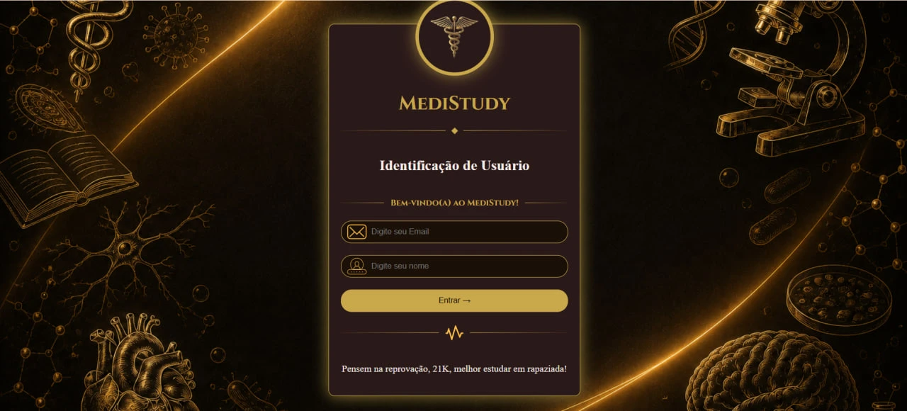
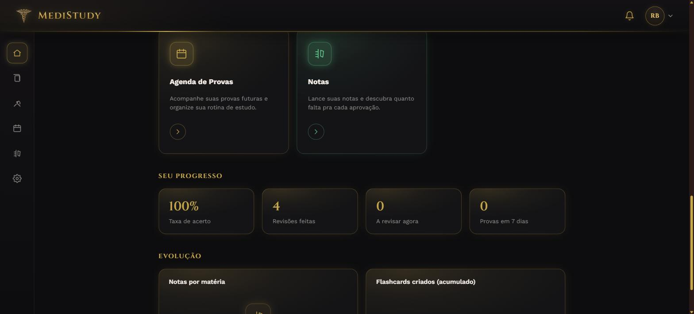
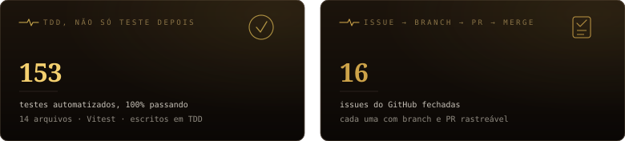
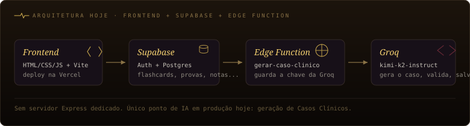
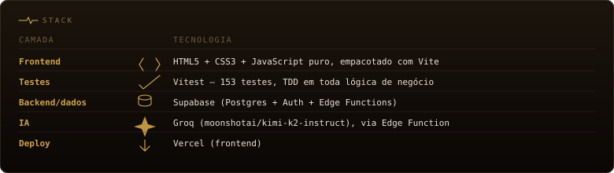

<p align="center">
  <a href="https://git.io/typing-svg"></a>
</p>

<p align="center">
  
  
  
</p>



<p align="center">
  
  
</p>


<h2 id="indice"></h2>

- [Motivação](#user-content-motivacao)
- [O que foi construído](#user-content-construido)
- [Números de impacto](#user-content-impacto)
- [Decisões técnicas](#user-content-decisoes)
- [Arquitetura e modelagem de dados](#user-content-arquitetura)
- [Stack](#user-content-stack)
- [Como rodar localmente](#user-content-rodar)
- [Onde está hoje](#user-content-hoje)
- [Visão futura](#user-content-futuro)


<h2 id="user-content-motivacao"></h2>

O gatilho foi ver a namorada, que tem TDAH, usando várias ferramentas de estudo diferentes ao mesmo tempo para dar conta da faculdade de medicina. Cada ferramenta resolvia um pedaço, nenhuma resolvia o problema inteiro. Captei o que ela realmente usava no dia a dia e comecei o MediStudy a partir disso.

O formato final veio de uma reflexão mais ampla. Cerca de um ano e meio antes, eu já tinha pedido um protótipo de "MediStudy" ao Claude, via chat: era só conversa, esbarrava no limite de token do plano e exigia pedir tudo de novo a cada uso. Usar várias ferramentas soltas tinha o mesmo problema de fundo, cada uma pedia acesso e configuração próprios. O MediStudy nasce como resposta a essa fragmentação, antecipando tudo num só lugar em vez de forçar o aluno a montar o próprio quebra-cabeça de ferramentas.

O TDAH da namorada foi o gatilho real, mas o MediStudy não é pensado como um app de nicho para TDAH. A filosofia central é ser um "camaleão": a IA se adapta ao máximo a cada estudante individualmente, qualquer que seja o jeito dele de aprender, não só ao caso que disparou a ideia. Construir isso também é, na prática, a forma que escolhi para aprender fundamentos de programação.


<h2 id="user-content-construido"></h2>

O MediStudy já tem seis páginas funcionais em uso real, mais um redesign visual em andamento.

O **Login** tem identidade clínica, dourado e vinho sobre fundo escuro, fonte Cinzel. A identificação é por nome e email. Tentar enviar com um campo vazio bloqueia o envio com feedback visual, o campo pisca em vermelho, em vez de um alert do navegador.

A **Home** tem sidebar de navegação fixa, o bloco "Missão do dia" e um grid de ferramentas de estudo. Cards de estatística mostram progresso real (taxa de acerto, streak de dias revisando, provas nos próximos 7 dias), lidos direto do Supabase.

O **Flashcards** é a ferramenta mais madura do produto: repetição espaçada (fator de facilidade entre 1.3 e 2.8, ajustado a cada acerto/erro, intervalo em dias recalculado a cada revisão), importador de baralhos do Anki, e dois modos de revisão dedicados — Revisão Rápida (seleciona quantos cards cabem em 5 minutos, dos mais atrasados pros menos) e Véspera de Prova (todos os cards de uma matéria, do mais difícil pro mais fácil). O card de revisão vira em 3D pra mostrar pergunta e resposta.

**Casos Clínicos** gera casos de múltipla escolha por IA: o app chama uma Supabase Edge Function, que chama a Groq (modelo `moonshotai/kimi-k2-instruct`), valida o formato da resposta antes de salvar, e registra se a usuária acertou ou errou cada caso resolvido.

**Provas** mantém a agenda de provas (com contagem de dias até a próxima) e **Notas** calcula a nota mínima necessária na prova restante pra bater a média da matéria.

O **histórico de evolução** mostra gráficos de linha (nota por matéria ao longo do tempo, flashcards criados de forma acumulada), e o **sino de notificação**, presente em todas as páginas internas, mostra quantos flashcards estão prontos pra revisão agora e leva direto pra Revisão Rápida ao clicar.

Por fim, o produto está em **redesign visual**: a Fase 1 (fundação — tokens semânticos de cor/tipografia/espaçamento, cards unificados, select customizado acessível) e a Fase 2 (motion — flip 3D do flashcard, entradas em stagger, skeleton loading, microinterações, tudo respeitando `prefers-reduced-motion`) já estão completas. Uma Fase 3 (carrosséis no mobile) está em andamento, e as Fases 4 e 5 (navegação mobile, limpeza final) estão documentadas como issues abertas no GitHub.

O grid de ferramentas ainda reserva espaço pra Mapas Mentais, Questões, Simulador de Anamnese e "Explique pro Professor" — esses cards levam hoje a uma página de "em breve", não a uma funcionalidade real. Isso está descrito na seção [Visão futura](#user-content-futuro).


<h2 id="user-content-impacto"></h2>



Sem base de usuários para mostrar ainda, então os números honestos aqui são de construção e uso real, não simulados: o próprio Ryan e a namorada, estudando para o 4º período de medicina, usam o app no dia a dia. 153 testes automatizados cobrem toda a lógica de negócio (repetição espaçada, cálculo de nota, importador Anki, estatísticas, validação de caso clínico, entre outros), escritos em TDD antes da implementação. 16 issues do GitHub já foram fechadas, cada uma com sua branch e PR correspondente.


<h2 id="user-content-decisoes"></h2>

**Chamar a Groq direto do frontend ou passar por uma Edge Function?**
Em desenvolvimento, os pedidos de IA passam pelo OmniRoute, um roteador local. Isso não existe em produção: o site publicado não tem acesso a esse roteador nem pode expor a chave da Groq no navegador. A geração de Casos Clínicos foi movida para uma Supabase Edge Function (`gerar-caso-clinico`), que guarda a chave da Groq como secret do lado do servidor e mantém o mesmo modelo do plano original com OmniRoute (`moonshotai/kimi-k2-instruct`), só que servido direto pela Groq para funcionar em produção.

**Por que só Groq, sem Claude, apesar do plano original prever Claude para raciocínio pesado?**
O planejamento inicial (`planejamento.md`) previa Claude para os casos mais complexos e Groq só para respostas rápidas. Na implementação, Claude foi deixado de fora do roteamento gratuito de produção: hoje nenhuma chamada a Claude/Anthropic existe no código, só Groq. Claude fica reservado para quando uma funcionalidade justificar seu custo (fora da camada gratuita), em vez de entrar por padrão em tudo que pede IA.

**Vercel + Supabase em vez de Render/Express/Docker.**
O Postgres gratuito do Render expira em 30 dias, o que é inviável para um app de uso contínuo. A stack ficou frontend na Vercel e backend/dados no Supabase (Postgres + Edge Functions), sem servidor Express dedicado nem Docker.

**Tokens semânticos de design com aliases legados, em vez de reescrever o CSS de uma vez.**
A Fase 1 do redesign introduziu tokens semânticos de cor, tipografia, espaçamento, raio e sombra em `:root`. Em vez de migrar todo o CSS existente de uma tacada (arriscando regressão visual em página que já funcionava), os nomes antigos de variável (`--primary-color`, `--secondary-color` etc.) foram mantidos como aliases apontando para os tokens novos. Código novo usa os tokens semânticos; o legado migra conforme cada página é tocada, não tudo de uma vez.

**Onde chamar `localStorage.setItem`?**
Na primeira versão a chamada estava fora do listener de clique do botão Entrar. O nome do usuário não persistia corretamente entre o login e a Home, porque o valor era lido antes de o usuário efetivamente preencher o campo. Movi a chamada para dentro do handler de clique, junto com a leitura dos valores dos inputs, o que resolveu a perda de dado entre as duas telas.

**Animar o card e o fundo com transições independentes ou com um estado compartilhado?**
A primeira tentativa animava o card (`#login-container`) e o wallpaper de fundo (`body::before`) com transições próprias, cada um reagindo ao seu próprio gatilho. O efeito de "o card acende e sobe" e o desfoque do fundo rodavam de forma perceptivelmente descolada. Troquei para os dois reagirem à mesma classe CSS (`ativo`), aplicada simultaneamente ao `body` e ao card, o que garante que os dois efeitos disparam no mesmo instante.

**Como animar a linha de ECG sem depender de uma lib externa?**
Em vez de trazer uma biblioteca de animação só para simular uma linha "correndo", o efeito é feito com camadas de `<path>` (`ecg-c1` a `ecg-c4`) usando o mesmo traçado, cada uma defasada e com opacidade diferente via `pathLength` e `stroke-dashoffset` em CSS. A sobreposição das camadas cria a sensação de traço contínuo com brilho, sem nenhuma dependência JS extra.


<h2 id="user-content-arquitetura"></h2>



O frontend é HTML, CSS e JavaScript puro, sem framework, empacotado com Vite (sem esse bundler no fluxo de produção, os módulos ES não seriam otimizados para deploy). Cada página (`login`, `home`, `flashcards`, `provas`, `notas`, `casos-clinicos`) importa serviços de `src/services/` e componentes de `src/components/`, todos com lógica de negócio isolada e testada separadamente da manipulação de DOM.

Autenticação, flashcards, provas, notas e casos clínicos persistem no Postgres do Supabase, acessado via `@supabase/supabase-js`. A única funcionalidade que sai da Vercel/Supabase é a geração de Casos Clínicos, que passa por uma Edge Function (`supabase/functions/gerar-caso-clinico`) antes de chamar a Groq — ver [Decisões técnicas](#user-content-decisoes) para o motivo de existir essa camada extra em vez de chamar a Groq direto do navegador.


<h2 id="user-content-stack"></h2>




<h2 id="user-content-rodar"></h2>

```bash
git clone https://github.com/RyanDua11/medistudy.git
cd medistudy
npm install
npm run dev      # servidor local via Vite
npm test         # roda os 153 testes com Vitest
npm run build    # build de produção em dist/
```

Flashcards, Provas, Notas e Casos Clínicos dependem de um projeto Supabase configurado (URL + chave anônima em `src/services/supabaseClient.js`) e, para Casos Clínicos especificamente, do secret `GROQ_API_KEY` configurado na Edge Function (`supabase secrets set GROQ_API_KEY=...`). Sem isso, essas páginas carregam mas as chamadas ao banco/IA falham.


<h2 id="user-content-hoje"></h2>

Em desenvolvimento ativo, com múltiplas ferramentas funcionais em uso real por Ryan e a namorada: Login, Home, Flashcards (com repetição espaçada e importador Anki), Provas, Notas, Casos Clínicos gerados por IA, histórico de evolução com gráficos e notificação de repetição espaçada. O redesign visual está em fase avançada — 2 das 5 fases planejadas já completas, uma terceira em andamento. O restante do planejamento original (mapas mentais, questões, simulador de anamnese, contexto por professor, compartilhamento em grupo) ainda está por construir, ver [Visão futura](#user-content-futuro).


<h2 id="user-content-futuro"></h2>

> Ainda não implementado, visão futura, cada item pensado como mais uma forma de a IA se adaptar ao estudante:
> - Mapas mentais interativos e banco de Questões — hoje só existem como cards "em breve" no grid da Home.
> - Simulador de Anamnese, com IA no papel do paciente.
> - Modo "Explique pro Professor", avaliando a resposta da aluna pelo estilo específico de cada professor.
> - Contexto por professor: PDFs de aula/prova sobem e alimentam um histórico ligado ao professor daquela turma.
> - Compartilhamento em grupo: caso clínico ou prova simulada gerados por uma aluna, disponíveis pra turma revisar junto.
> - Modo offline para flashcards/mapas mentais já gerados.
> - Integração com Google/Apple Calendar para a agenda de provas.
> - Orquestração de múltiplas IAs (Claude para raciocínio pesado, Gemini para imagem/PDF) além do Groq já em produção, escolhendo o modelo certo por tipo de pedido.
> - Diário de erros inteligente, identificando o padrão de dificuldade da própria aluna.
